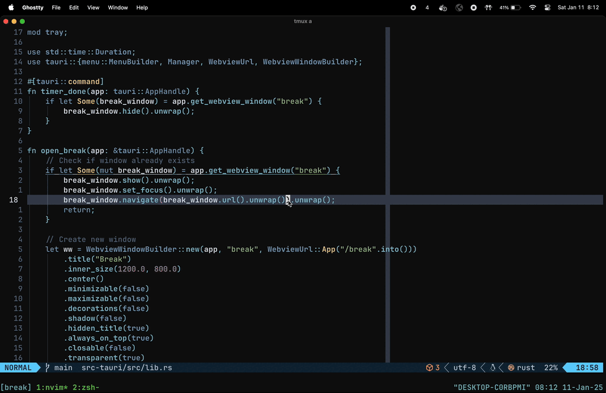

# Break

A simple menubar app that reminds you to take a small break. Follows the
**20 minutes + 20 seconds** break.



> [!NOTE]
> This was built for my personal workflow, so feel free to adjust it to fit your
> liking

## About

The application is built with Tauri and Svelte. Tested on macos.

## Usage

The app lives in the menubar and triggers the break every 20 minutes. Holding
`ESC` will skip the break.

To disable, simply quit the app.

> [!TIP]
> Looks especially well with a dark background

## Customization

The break page is found at `./src/routes/break/+page.svelte`.

To change the interval of the break, update the sleep duration in `./src-tauri/src/lib.rs`

## Development

To run the application locally, run:

```bash
pnpm tauri dev
```

To bundle the application, run:

```bash
pnpm tauri build
```
